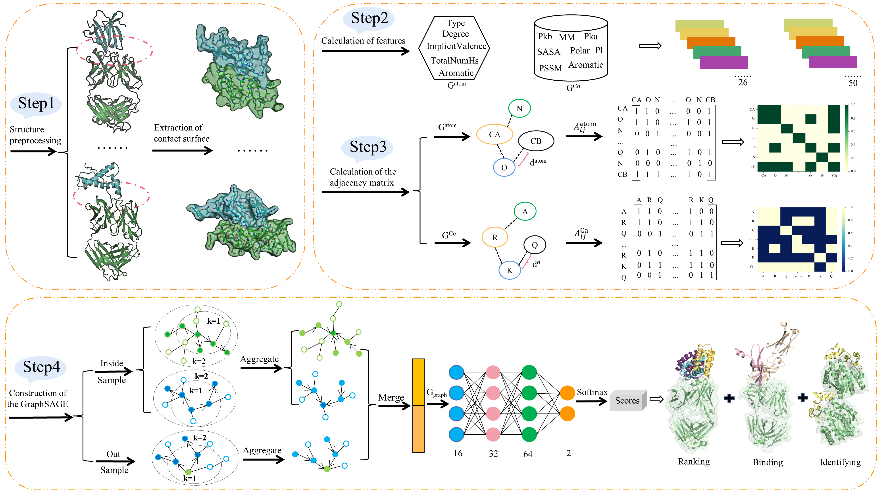

# SAGERank
`SAGERank: Inductive Learning of Protein-Protein Interaction from Antibody-Antigen Recognition using Graph Sample and Aggregate Networks Framework`

## `The framework of SAGERank:`

## `Features: powerful inductive ability` 
The SAGERank models trained for antibody-antigen docking can be used to examine generally protein-protein interaction docking, determining whether protein and protein can bind and differentiate crystal packing from biological interface.

## Dependencies
biopython==1.79  
freesasa==2.0.3.post7  
numpy==1.23.3  
pdb2pqr=3.5.2  
pdb2sql=0.5.1  
pssm=0.1.0  
PSSMGen=1.1.2  
scikit-learn==1.0.2  
torch-geometric==2.0.3  
MEGADOCK==4.0.2  
eppic WebServer：(https://www.eppic-web.org/)
## Data preparation
1. `Preprocessing the structure of the complex.` It mainly includes the combination of the light and heavy chain of the antibody and the renaming of the amino acid number, and the antibody antigen is split into two files, and the chain name should be unified (C and D).
2. `Access a large number of conformations using docking software.` megadock is used for molecular docking, during which the CDR region of the antibody is locked and the antigen spins freely.
3. `Three-dimensional structure extraction of contact surface.` Obtain structures in the 10 angstrom range of the contact surface of the antibody antigen complex or protein protein complex.(You can also freely define the size)
4. `Generating a graph structure file.` You can choose the node construction based on amino acids or atoms, or you can choose to calculate the relationship between amino acid pairs and atomic pairs based on the antibody CDR region or three-dimensional coordinates.
## Training on your own data set
Follow the steps in data preparation, if you have access to a large number of graph structure files, then you can use the `train.py` script for training, and you can also use `test.py` for testing related tasks

