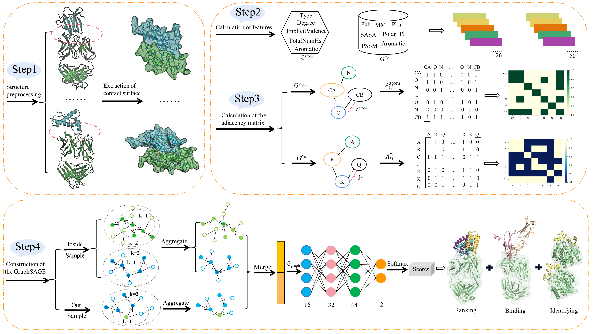

# SAGERank
SAGERank: Inductive Learning of Protein-Protein Interaction from Antibody-Antigen Recognition using Graph Sample and Aggregate Networks Framework
The framework of SAGERank

Main results:
